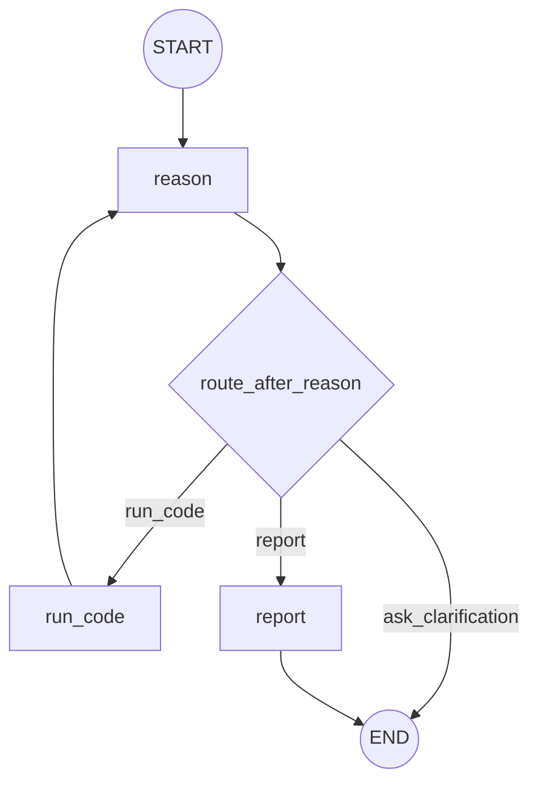

# 自律型データ分析AIエージェント 設計（design.md）

## 目的

`requirements.md` に基づき、ユーザーアップロード済みCSVに対して、要求の明確化→分析方針決定（Reason）→コード生成/実行（Run Code）→結果観察とFix→レポート生成（Report）までを行うLangGraphエージェントの設計を定義する。

## 設計方針（AGENTS.md準拠）

- **単一責務**: 1ノード=1責務（Reason / Run Code / Report）。
- **Stateは不変として扱う**: ノードはState全体ではなく「更新差分」を返す。
- **Reducer活用**: `messages` は `add_messages` を使う。
- **Pydanticで契約を固定**: ノード/エッジ/ツールの入出力をPydanticで定義し、実装のズレを防ぐ。
- **安全ガード**: 要件にある通り `exec` 実行のリスクを前提に、タイムアウト・出力上限・危険操作の抑止を設計に含める（完全な隔離は別途拡張）。

## グラフ構成図（Mermaid）

要件の図を、実装で必要な「条件分岐（edge）」を明示した形に落とす。



## State設計

### Stateの責務
- 会話/要求（ユーザー入力、確認質問）
- df（DataFrame本体）
- コード実行履歴（生成コード、stdout/stderr、表/グラフ等（実体）、エラー）
- レポート（最終出力）

### 実装用State（TypedDict + Reducer）

```python
from __future__ import annotations

from typing import Annotated, Literal, Sequence
from typing_extensions import TypedDict

from langchain_core.messages import BaseMessage
from langgraph.graph.message import add_messages


class AgentState(TypedDict):
    # 会話（自動追記）
    messages: Annotated[Sequence[BaseMessage], add_messages]

    # データ本体（ユーザー要望によりStateに保持する）
    # NOTE: pandas.DataFrame はJSONシリアライズ不可。
    #       本プロトタイプは InMemorySaver 前提（再起動で状態は消える）として、dfをStateに保持する。
    df: object  # 実装では pandas.DataFrame を想定

    # Reasonの決定（Pydantic: ReasonDecision）
    decision: dict | None

    # Run Codeの実行結果（Pydantic: ExecResult）
    last_code: str | None
    last_exec: dict | None

    # レポート（Pydantic: ReportOutput）
    report: dict | None
```

> 注: 実装上はPydanticモデルをそのままStateに入れるより、`model_dump()` したdictを入れる方がLangGraphのシリアライズと相性が良い。
> 追記: 本プロトタイプは `InMemorySaver` 前提（永続化しない）とし、DataFrame本体をStateに保持する。
> 追記: CSVアップロード処理はグラフ外（アプリ側）で行い、グラフ開始時点で `df` はStateに投入済みとする（単一CSV前提）。

## Pydanticモデル（契約定義）

### 共通モデル

```python
from __future__ import annotations

from typing import Any
from pydantic import BaseModel, Field


class ExecResult(BaseModel):
    """exec実行の観測結果。"""
    ok: bool
    stdout: str = ""
    stderr: str = ""
    # 生成物（プロトタイプは参照IDではなく実体をそのまま保持する）
    # - plot_png_base64: PNGのbase64文字列（data URLではなくbase64本体を想定）
    # - table_markdown: Markdownの表
    # - json: JSON相当（dict/listなど）
    plot_png_base64: list[str] = Field(default_factory=list)
    table_markdown: list[str] = Field(default_factory=list)
    json: list[Any] = Field(default_factory=list)
    error_type: str | None = None
    error_message: str | None = None
```

## ノード設計（入力/出力は必ずPydantic）

### 1) `reason` ノード（LLM使用）

#### 責務
- ユーザー要求が不明確なら「確認質問」を生成して **END** へ（REQ-001/002）。
- 明確なら、次のアクションを決める（Run Code / Report ）。
- Run Codeに渡す「分析タスクの自然言語指示」を生成する（REQ-010/011）。
- 直前の実行失敗があれば、Fix方針（どこをどう直すか）を含める（REQ-023）。
  - `last_exec.ok == False` の場合、エラー原因を `stderr` / `error_type` / `error_message` / `last_code` から判断し、
    **情報不足が原因なら `ask_clarification` を選んでユーザーに質問**し、**実装ミスが原因なら `run_code` を選んで修正指示を更新して再実行**する。

#### LLM
- **使用する**（意図把握、次アクション決定、Run Codeへの指示生成）。
- 出力は構造化（Pydantic）で固定する（再現性・ルーティング安定化）。

#### I/O

```python
from typing import Literal
from pydantic import BaseModel, Field


ReasonAction = Literal["ask_clarification", "run_code", "report"]


class ReasonNodeInput(BaseModel):
    # ユーザーとのやり取り全体を元に意図を判断し、analysis_instructionを生成する
    messages: list = Field(..., description="実装では Sequence[BaseMessage] を想定（会話履歴）")
    df: object = Field(..., description="実装では pandas.DataFrame を想定（Stateに保持）")
    last_exec: ExecResult | None = None
    last_code: str | None = None


class ReasonDecision(BaseModel):
    action: ReasonAction
    # action == ask_clarification のとき必須
    clarification_question: str | None = None

    # action == run_code のとき必須
    analysis_instruction: str | None = Field(
        default=None,
        description="Run Code に渡す自然言語タスク。目的/出力（表/グラフ）/使用列/手順を含む。"
    )


class ReasonNodeOutput(BaseModel):
    decision: ReasonDecision
```

### 2) `run_code` ノード（LLM使用 + exec実行）

#### 責務
- `decision.analysis_instruction` を受け、LLMにPythonコードを生成させる（REQ-020）。
- 生成コードを `exec` で実行し、stdout/stderr/成果物を収集する（REQ-021）。
- 失敗時はExecResultにエラーを格納し、Reasonに戻す（REQ-023）。
- 実行結果に応じてReasonへ戻し、次の「再実行（Fix）/レポート生成/終了」判断材料を残す（要件REQ-050）。

#### LLM
- **使用する**（pandas/可視化/クラスタリング等のコード生成、失敗時の修正案生成はReasonで行う）。

#### I/O

```python
from pydantic import BaseModel, Field


class RunCodeNodeInput(BaseModel):
    df: object = Field(..., description="実装では pandas.DataFrame を想定（Stateに保持）")
    analysis_instruction: str


class RunCodeNodeOutput(BaseModel):
    last_code: str
    last_exec: ExecResult
```

#### 実行環境（最低限のガード設計）
- **タイムアウト**: 例 3分（180秒）（NFR-005）
- **出力上限**: stdout/stderrの文字数上限（NFR-002/005）
- **危険操作の抑止**（ベストエフォート）:
  - `import os/subprocess/socket` 等を静的に拒否（AST/文字列スキャン）
  - `open()` 等のファイルI/Oを拒否
  - `__import__` や `eval/exec` の多重利用を拒否
> 注意: これらは「完全な安全」にはならない。将来は別プロセス/コンテナ化を拡張タスクとして扱う。

### 3) `report` ノード（LLM使用）

#### 責務
- 分析タスクと実行結果（表/グラフ参照）を元にレポートを生成する（REQ-030/031）。
- ブラウザ表示可能な形式（例: Markdown/HTML + 表/グラフ等（実体））で出力する（REQ-032）。
- レポート提示をもって終了する（要件）。
  - 分析指示（analysis_instruction）は `decision.analysis_instruction` を参照元として一本化する。
  - `decision.analysis_instruction` と `last_exec` を根拠に `ReportOutput.summary` をLLMが生成する。

#### LLM
- **使用する**（文章生成、構成、注意点の整理）。

#### I/O

```python
from pydantic import BaseModel, Field


class ReportNodeInput(BaseModel):
    decision: ReasonDecision
    last_exec: ExecResult


class ReportOutput(BaseModel):
    # レポート本文（短い要約）。必要ならMarkdownで返してよい。
    summary: str
    # レポートに添付する成果物（プロトタイプは参照ではなく実体をそのまま返す）
    plot_png_base64: list[str] = Field(default_factory=list)
    table_markdown: list[str] = Field(default_factory=list)
    json: list[Any] = Field(default_factory=list)


class ReportNodeOutput(BaseModel):
    report: ReportOutput
```

## エッジ設計（条件分岐ロジック）

### `route_after_reason`（必須）

#### 責務
- Reasonの決定に応じて次ノードを返す。
- Reasonの「ask_clarification / report / run_code」を実装上の次ノードへ写像する。

#### I/O（Pydantic）

```python
from typing import Literal
from pydantic import BaseModel


class RouteAfterReasonInput(BaseModel):
    decision: ReasonDecision


RouteAfterReasonOutput = Literal["run_code", "report", "__end__"]
```

#### ルーティング仕様
- `decision.action == "ask_clarification"` → `__end__`（質問をmessagesに入れて終了）

- `decision.action == "report"` → `report`
- `decision.action == "run_code"` → `run_code`

## ツール設計（I/OをPydanticで定義）

> 要件では「Run CodeはLLMがコード生成しexecで実行」とあるため、実装上はノード内実行でも成立する。  
> ただし、`AGENTS.md` の保守性観点から、外部I/Oや実行を「ツール」として切り出す設計を推奨する。

### T-002: `exec_python`（exec実行ユーティリティ）

#### 目的
生成コードを実行し、`ExecResult` を返す。出力制限とタイムアウトを提供する。

```python
from pydantic import BaseModel, Field


class ExecPythonInput(BaseModel):
    code: str = Field(..., description="実行するPythonコード")
    timeout_sec: int = Field(default=180, ge=1, le=300, description="実行タイムアウト秒（デフォルト180秒）")
    max_output_chars: int = Field(default=20000, ge=1000, le=200000, description="stdout/stderr合計の上限")

    # 実行コンテキスト（例: df を渡す）
    context: dict = Field(default_factory=dict, description="実行用の変数（例: {'df': <DataFrame>}）")


class ExecPythonOutput(BaseModel):
    result: ExecResult
```

## LLMの利用箇所（必須）

- **Reasonノード**: 意図把握・要求明確化判定・次アクション決定・Run Codeへの自然言語指示生成（構造化出力）。
- **Run Codeノード**: 自然言語指示→Pythonコード生成（pandas/可視化/クラスタリング等）。
- **Reportノード**: 実行結果（`last_exec` の stdout/表/グラフ等、`decision.analysis_instruction`）からレポート（Markdown/HTML）生成。

## ループ（Fix）の扱い

- `run_code.last_exec.ok == False` のとき、Reasonノードが `last_exec.stderr` と `last_code` を材料に「どこを直すか」を判断し、次の `analysis_instruction` を更新して `run_code` を選ぶ。
- ただし、エラー原因が「ユーザーの追加情報が必要（目的変数や前提条件が不明など）」と判断された場合は、`ask_clarification` を選んでユーザーに質問して終了し、次回ユーザー回答を受けて再開する。
- 停止条件はReasonが判断する（例：要求が不明確→確認質問で終了、要求が満たせた→Report）。


