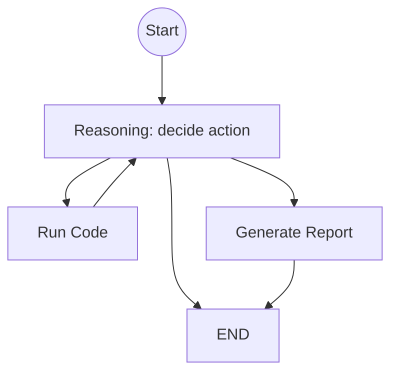

# 自律型データ分析AIエージェント 要件定義（requirements.md）

## 背景・目的

ユーザーがアップロードしたCSVデータに対して、ユーザー意図を正確に把握し、探索的データ分析（EDA）やクラスタリング等の分析計画を柔軟に立案・実行する自律型データ分析AIエージェントを作成する。  
実行されたコードの結果を観察し、必要に応じて自動修正（Fix）を行いながら、最終的にグラフやレポートとしてブラウザに可視化し、レポート提示をもって完了とする。

## スコープ

### 対象
- ユーザーアップロード済みCSVに対する分析（EDA、集計、可視化、クラスタリング等）
- ユーザー要求の明確化（曖昧な場合は確認質問）
- 分析タスクの立案（Reason）
- コード生成・実行（Run Code）
- 結果の観察と自動修正（Fix）ループ
- レポート生成（表・グラフを含む）とブラウザ可視化

### 非対象（現時点）
- CSV以外の入力（DB/Parquet等）
- 分散処理や超大規模データ最適化

## グラフ構成（Mermaid）

## エージェントの責務と期待される振る舞い

- ユーザー要求が不明確なら、要求が明確になるような質問をユーザーにして終了する
- ユーザー要求が明確なら、Reasonで分析タスクを自然言語で定義してRun Codeへ指示する
- Run CodeではLLMがPythonコードを生成し、`exec` で実行して結果（標準出力/標準エラー/生成物）を得る
- 実行結果を観察し、必要に応じてFix（コード修正）を行いながらReasonへ戻る
- ユーザー要求が満たせたなら、Reportで分析タスク・実行結果を元に、グラフ/表を含むレポートを生成する
- レポートを生成して提示した時点で完了する

## 入力 / 出力

### 入力
- CSVデータ（ユーザーアップロード済み）
- ユーザーの分析要求（自然言語）

### 出力
- **確認質問**（要求が不明確な場合）
- **分析レポート**（summary + 表/グラフ（あれば））
- **再現性情報**（分析タスク、主要結果。実行コードは内部ログとして保持）

## 機能要件（REQ-XXX：EARS記法）

### 要求の明確化（Clarification）

- **REQ-001（Event-driven）**: ユーザーが分析要求を送信したとき、システムは要求が不明確であれば要求が明確になる質問を返し、処理を終了しなければならない。
- **REQ-002（Ubiquitous）**: システムは、要求が明確でない状態でコード実行に進んではならない。

### Reason（方針決定）

- **REQ-010（Event-driven）**: ユーザー要求が明確なとき、システムは分析タスクを自然言語で定義しなければならない。
- **REQ-011（Ubiquitous）**: システムは、分析タスクに「目的」「使用する列（分かる範囲）」「期待する出力（表/グラフ/指標）」を含めなければならない。
- **REQ-012（Ubiquitous）**: システムは、推測で数値を断定せず、必要に応じて実行結果に基づいて回答しなければならない。

### Run Code（コード生成・実行）

- **REQ-020（Event-driven）**: システムは、Reasonで定義した分析タスクに基づいてPythonコードを生成しなければならない。
- **REQ-021（Event-driven）**: システムは、生成したPythonコードを `exec` で実行し、実行結果（標準出力/標準エラー/生成物）を取得しなければならない。
- **REQ-022（Ubiquitous）**: システムは、実行結果を観察し、次に「再実行（Fix）」「レポート生成」「終了」のいずれに進むかを判断しなければならない。
- **REQ-023（State-driven）**: もし実行が失敗した場合、システムはエラー原因を推定し、コードまたは前処理/パラメータを修正して再実行するためにReasonへ戻らなければならない。

### Report（レポート生成）

- **REQ-030（Event-driven）**: システムは、ユーザー要求が満たせたと判断したとき、分析タスクと実行結果を基にレポートを生成しなければならない。
- **REQ-031（Ubiquitous）**: レポートは少なくともsummary（結論/根拠を含む短い説明）を含み、実行結果に表やグラフがある場合はそれらを含めなければならない。
- **REQ-032（Ubiquitous）**: システムは、レポートをブラウザで可視化できる形式で出力しなければならない。

### 停止

- **REQ-050（Ubiquitous）**: システムは、ユーザー要求が満たされたと判断した場合はレポートを生成して終了しなければならない。

## 非機能要件（NFR-XXX）

- **NFR-001（レイテンシ）**: 一般的なEDA/集計がユーザー許容時間内で完了することを目標とする。
- **NFR-002（トークン/出力制御）**: 表やログの出力は上限を設け、必要に応じて要約すること。
- **NFR-003（再現性）**: 実行した分析タスク、実行コード、主要な結果を保存/表示できること。
- **NFR-004（保守性）**: ノードは単一責務とし、State更新は差分で行うこと（`AGENTS.md` に準拠）。
- **NFR-005（安全性）**: `exec` 実行によるリスクを認識し、最低限のガード（実行時間上限、出力上限、危険操作の抑止）を実装すること。

## 使用するLLMモデルと理由

- **候補**: ツール呼び出し/コード生成が安定するモデル（例：`gpt-4o-mini` 相当）
- **理由**:
  - 分析タスクの言語化（Reason）とコード生成（Run Code）の両方が必要
  - エラー原因推定と自動修正（Fix）に一定の推論能力が必要

## 成功条件（Doneの定義）

- 不明確な要求に対し、適切な確認質問を返して終了できる
- 明確な要求に対し、Reason→Run Codeのループで分析を進められる
- 要求が満たされたとき、表・グラフを含むレポートを生成しブラウザ可視化できる
- レポート提示で完了できる

