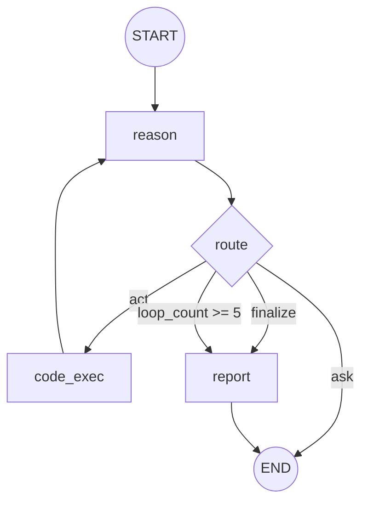
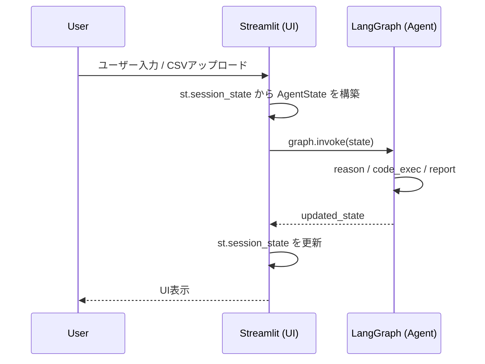

# design.md（ReAct型データ分析AIエージェント / LangGraph）

## 概要

本エージェントは **LangGraph** で構成するReAct型データ分析エージェントである。
**reasonノード** がユーザー要求を解釈し、次のアクションと分析指示を決定する。
**code_execノード** は分析指示を受け取り、コード生成→実行を一括で行い結果を返す。
最後に **reportノード** が Markdownレポート（最低限: 結論・根拠）をユーザーに見やすい形で生成して UI に表示する。

## 制約（requirementsからの転記）

- ネットワーク: **OpenAI（LLM API）通信のみ許可**
- ファイル: CSVデータおよび生成したグラフは **ワークディレクトリ（`./workspace/<yyyymmddhhmmss>/`）** に保存する。ワークディレクトリ外へのファイルアクセスは禁止。
- リソース: 1分析アクション **3分 / 1GB**
- ReActループ上限: 1つの分析要求に対して **最大5回**。超過時は中間結果を提示して終了。
- 許可ライブラリ: `pandas`, `numpy`, `sklearn`, `matplotlib`, `seaborn`
- 国際化: グラフ・レポート出力は **日本語** を正しく表示
- セッション管理: 会話履歴は **Streamlitの`st.session_state`** で保持（LangGraphのcheckpointerは使用しない）

## グラフ構成

### 構成要素の対応（ノード/エッジ）

本設計における用語の対応は以下の通り。

- **ノード（Node）**: LangGraph の `graph.add_node(name, fn)` で登録する処理単位
- **エッジ（Edge）**: LangGraph の `graph.add_edge(...)` / `graph.add_conditional_edges(...)` による遷移

#### ノード一覧

| node名 | 責務 | 主な入力（State） | 主な出力（State更新） |
|---|---|---|---|
| `reason` | ユーザー要求を解釈し、次アクションと分析指示を決める | `messages`, `df`, `df_info`, `execution_results`, `loop_count` | `next_action`, `instruction`, `messages`, `loop_count` |
| `code_exec` | 分析指示からコード生成→実行を一括で行う | `instruction`, `df`, `df_info`, `workspace_dir` | `execution_results`（追加） |
| `report` | 最終レポート生成 | `messages`, `execution_results`, `assumptions` | `final_report` |

#### エッジ（遷移）一覧

| from | to | 種別 | 条件/理由 |
|---|---|---|---|
| `START` | `reason` | 直結 | 初回実行 |
| `reason` | `END` | 条件付き | `next_action == "ask"`（このターンは質問文を返して終了） |
| `reason` | `code_exec` | 条件付き | `next_action == "act"` |
| `reason` | `report` | 条件付き | `next_action == "finalize"` |
| `code_exec` | `reason` | 直結 | 実行結果をreasonへ戻す（ReActループ） |
| `report` | `END` | 直結 | 完了 |

### Mermaid



### 役割

- `reason`: ユーザー要求を解釈し、次アクションを決定する。分析が必要な場合は `instruction`（自然言語の分析指示）を生成して `code_exec` へ渡す。
- `ask`（`next_action="ask"`）: **このターンは `reason` が質問文（AIMessage）を生成して終了**する。次ターンのユーザー回答は新しい `graph.invoke()` で `messages` に入り、`reason` が再判断する。
- `code_exec`: 分析指示を受け取り、LLMでコードを生成し、実行して結果を返す。判断は行わない。
- `report`: Markdownレポートを生成してStateに保存し終了する。

補足（運用前提）:
- Streamlit(UI)はユーザー入力のたびに **1回 `graph.invoke()`** する運用を前提とする（同一invoke内で「質問→ユーザー回答」を扱わない）。

### 終了条件（requirements準拠）

- `reason` が「ユーザー要求を満たした」と判断したら `finalize` を返す（`REQ-DONE-001`）。
- 深掘り案がある場合は report に任意提案として添付してよい（`REQ-DONE-002`）。

## State設計

### 方針

- StateにはDataFrameを直接格納してよい（プロンプトには含めないため問題なし）。
- `messages` は `add_messages` で蓄積する。
- 生成物（表/図/テキスト）は型を分離して管理する。

### セッション/コンテキスト管理

本エージェントは **Streamlitの`st.session_state`** を使用して会話履歴を管理する。

- `st.session_state["messages"]`: 会話履歴（`BaseMessage`のリスト）
- `st.session_state["df"]`: 現在のDataFrame
- `st.session_state["workspace_dir"]`: 現在のワークディレクトリパス（`./workspace/<yyyymmddhhmmss>/`）

### Streamlit ↔ LangGraph データフロー

Streamlit（UI）とLangGraph（エージェント）間のデータの流れを明確化する。



**責務分担:**
- **Streamlit**: `st.session_state` でデータを永続化。`graph.invoke()` 前に `AgentState` を構築し、戻り値で `st.session_state` を更新。
- **LangGraph**: `AgentState` を受け取り、処理して更新された状態を返す。永続化は行わない。

### CSV初期化フロー

ユーザーがCSVをアップロードした際の初期化処理:

```python
def on_csv_upload(uploaded_file):
    # 1. DataFrameを読み込み
    df = pd.read_csv(uploaded_file)
    st.session_state["df"] = df
    
    # 2. df_info を生成
    df_info = DataFrameInfo(
        shape=df.shape,
        columns=df.columns.tolist(),
        dtypes={col: str(dtype) for col, dtype in df.dtypes.items()},
        head=df.head().to_dict(orient="records")
    )
    st.session_state["df_info"] = df_info
    
    # 3. ワークディレクトリを作成（初回のみ）
    if st.session_state.get("workspace_dir") is None:
        timestamp = datetime.now().strftime("%Y%m%d%H%M%S")
        workspace_dir = f"./workspace/{timestamp}"
        os.makedirs(workspace_dir, exist_ok=True)
        st.session_state["workspace_dir"] = workspace_dir
    
    # 4. CSVをワークディレクトリに保存
    df.to_csv(f"{st.session_state['workspace_dir']}/uploaded.csv", index=False)
```

### Pydanticモデル定義

```python
from __future__ import annotations

from typing import Annotated, Literal, Sequence, Any
import operator

import pandas as pd
from pydantic import BaseModel, Field
from langchain_core.messages import BaseMessage
from langgraph.graph.message import add_messages


# --- Artifact型 ---

class ExpectedOutput(BaseModel):
    """コード生成時に定義される出力のメタデータ"""
    file_name: str  # 例: "region_sales.png"
    description: str  # 例: "地域別売上の棒グラフ"
    output_type: Literal["figure", "table"]


class CodeGenOutput(BaseModel):
    """LLMのコード生成出力（構造化出力）"""
    code: str
    expected_outputs: list[ExpectedOutput]


class ReasonOutput(BaseModel):
    """reasonノードのLLM出力（構造化出力）"""
    next_action: Literal["ask", "act", "finalize"]
    instruction: str | None = None  # next_action=="act"の場合、分析指示
    question: str | None = None  # next_action=="ask"の場合、質問文
    assumption: str | None = None  # 仮定があれば
    rationale: str  # 判断理由（デバッグ用）


# --- 入出力型 ---

class DataFrameInfo(BaseModel):
    """DataFrameの概要情報（LLMプロンプト用）"""
    shape: tuple[int, int]
    columns: list[str]
    dtypes: dict[str, str]
    head: list[dict[str, Any]]  # 先頭5行のサンプル


class ExecutionResult(BaseModel):
    """コード実行結果"""
    success: bool
    code: str  # 実行したコード
    stdout: str | None = None  # 標準出力
    error: str | None = None  # エラーメッセージ
    outputs: list[ExpectedOutput] = Field(default_factory=list)  # 生成された出力のメタデータ


# --- レポート型 ---

class ReportSection(BaseModel):
    """レポートの1セクション"""
    section_type: Literal["text", "image", "table"]
    content: str  # text: Markdown / image: ファイルパス / table: JSON
    description: str | None = None  # 画像やテーブルの説明


class ReportOutput(BaseModel):
    """LLMのレポート生成出力（構造化出力）"""
    title: str
    sections: list[ReportSection]
    suggestions: list[str] | None = None  # 追加の深掘り提案


# --- AgentState ---

class AgentState(BaseModel):
    """LangGraph State"""
    messages: Annotated[Sequence[BaseMessage], add_messages]
    
    # DataFrame（プロンプトには含めない）
    df: pd.DataFrame | None = None
    df_info: DataFrameInfo | None = None  # プロンプト用の概要
    
    # ReActループ
    next_action: Literal["ask", "act", "finalize"] | None = None
    loop_count: int = 0
    
    # reason -> code_exec
    instruction: str | None = None  # 自然言語の分析指示
    
    # code_exec -> reason（複数回の実行結果を蓄積）
    execution_results: list[ExecutionResult] = Field(default_factory=list)
    
    # 仮定
    assumptions: list[str] = Field(default_factory=list)
    
    # ワークディレクトリ
    workspace_dir: str | None = None
    
    # 最終出力
    final_report: ReportOutput | None = None

    class Config:
        arbitrary_types_allowed = True
```

## ワークディレクトリ仕様

- ディレクトリ形式: `./workspace/<yyyymmddhhmmss>/`
- タイムスタンプ: ユーザーの最初のプロンプト送信時刻（セッション開始時）
- 保存対象:
  - アップロードされたCSVファイル
  - 生成されたグラフ（PNG等）
  - 最終レポート（Markdown）

## LLM入出力設計

各ノードでのLLM呼び出しにおける入力・出力・プロンプト方針を定義する。

### reason ノード

#### LLM入力

| 項目 | 型 | 説明 |
|---|---|---|
| messages | `list[BaseMessage]` | 会話履歴（システムプロンプト含む） |
| df_info | `DataFrameInfo` | DataFrameの概要（shape, columns, dtypes, head） |
| execution_results | `list[ExecutionResult]` | 過去の実行結果（あれば） |
| loop_count | `int` | 現在のループ回数 |

#### LLM出力（構造化出力）

```python
class ReasonOutput(BaseModel):
    """reasonノードのLLM出力"""
    next_action: Literal["ask", "act", "finalize"]
    instruction: str | None = None  # next_action=="act"の場合、分析指示
    question: str | None = None  # next_action=="ask"の場合、質問文
    assumption: str | None = None  # 仮定があれば
    rationale: str  # 判断理由（デバッグ用）
```

#### プロンプト方針

```
あなたはデータ分析アシスタントです。

## DataFrame情報
{df_info}

## 過去の実行結果
{execution_results の概要}

## ユーザー要求
{メッセージ履歴}

## タスク
以下のいずれかを選択してください：
- "ask": 分析に必要な情報が不足している場合、質問を生成
- "act": 分析を実行する場合、具体的な分析指示を生成
- "finalize": ユーザー要求を満たした場合、レポート生成へ
```

---

### code_exec ノード

#### LLM入力

| 項目 | 型 | 説明 |
|---|---|---|
| instruction | `str` | 自然言語の分析指示 |
| df_info | `DataFrameInfo` | DataFrameの概要 |
| workspace_dir | `str` | 出力先ディレクトリ |

#### LLM出力（構造化出力）

```python
class CodeGenOutput(BaseModel):
    """code_execノードのLLM出力"""
    code: str  # 実行するPythonコード
    expected_outputs: list[ExpectedOutput]  # 生成される出力のメタデータ
```

#### プロンプト方針

```
あなたはPythonコードを生成するアシスタントです。

## DataFrame情報
- shape: {df_info.shape}
- columns: {df_info.columns}
- dtypes: {df_info.dtypes}
- サンプル: {df_info.head}

## 分析指示
{instruction}

## 制約
- 変数 `df` でDataFrameにアクセスできます
- 使用可能ライブラリ: pandas, numpy, sklearn, matplotlib, seaborn
- 図を保存する場合: plt.savefig("{workspace_dir}/ファイル名.png")
- 日本語を正しく表示すること

## 出力
- code: 実行するPythonコード
- expected_outputs: 生成されるファイルと説明のリスト
```

---

### report ノード

#### LLM入力

| 項目 | 型 | 説明 |
|---|---|---|
| messages | `list[BaseMessage]` | 会話履歴 |
| execution_results | `list[ExecutionResult]` | 全ての実行結果 |
| assumptions | `list[str]` | 仮定リスト |

#### LLM出力（構造化出力）

```python
class ReportOutput(BaseModel):
    """reportノードのLLM出力"""
    title: str
    sections: list[ReportSection]
    suggestions: list[str] | None = None
```

#### プロンプト方針

```
あなたは分析結果をレポートにまとめるアシスタントです。

## 実行結果
{execution_results の詳細}

## 仮定
{assumptions}

## タスク
以下の形式でレポートを生成してください：
- title: レポートタイトル
- sections: セクションのリスト
  - section_type: "text" | "image" | "table"
  - content: テキスト/ファイルパス/JSON
  - description: 説明（image/tableの場合）
- suggestions: 追加の分析提案（任意）

## 注意
- 画像は file_name をそのまま content に設定
- テーブルは JSON形式 で content に設定
- 結論と根拠を必ず含めること
```

## ノード設計

### reason

#### 目的/責務

- ユーザー要求を解釈し、次のアクションを決定する。
- 分析が必要な場合は `instruction`（自然言語の分析指示）を生成する。
- `code_exec` の実行結果を観察し、追加分析が必要か判断する。

#### 入力（読むState）

- `messages`: 最新ユーザー発話を含む会話履歴
- `df`: DataFrame本体（Noneの場合はアップロード促し）
- `df_info`: DataFrameの概要（プロンプト用）
- `execution_results`: 過去の実行結果リスト（あれば）
- `loop_count`: 現在のループ回数

#### 出力（書くState）

- `next_action`: `"ask" | "act" | "finalize"`
- `instruction`: 分析指示（`next_action=="act"`の場合）
- `messages`: `next_action=="ask"` の場合、質問文（AIMessage）を追加
- `loop_count`: インクリメント
- `assumptions`: 仮定があれば追加

#### 判断ルール

- `df` が無い → `next_action="ask"`（アップロード促し）
- 分析する上で不足情報（列名/粒度/指標等）がある → `next_action="ask"`
- ユーザー要求を満たせた → `next_action="finalize"`
- それ以外 → `next_action="act"`

#### `next_action=="ask"` のときの挙動

- 質問文（仮説を含む最小限の質問）を `messages` に追加して終了する。
- ユーザー回答が得られるまで待機し、次ターンの `messages` として入り、次の `reason` が解釈する（同一invoke内で回答を待たない）。

### code_exec

#### 目的/責務

- `instruction`（自然言語の分析指示）を受け取り、以下を一括で行う:
  1. LLMの構造化出力でコードと出力メタデータを生成
  2. 生成したコードを実行
  3. 実行結果を `ExecutionResult` として返す

#### 入力（読むState）

- `instruction`: 自然言語の分析指示（例:「売上の月別推移を折れ線グラフで表示して」）
- `df`: DataFrame本体
- `df_info`: DataFrameの概要（コード生成時のLLMプロンプト用）
- `workspace_dir`: 出力先ディレクトリ

#### 出力（書くState）

- `execution_results`: 実行結果をリストに追加（ExecutionResult）

#### 内部処理フロー

```
instruction + df_info
    ↓
[LLM] 構造化出力（response_format=CodeGenOutput）
    ↓
CodeGenOutput { code: "...", expected_outputs: [...] }
    ↓
[exec()] code を実行
    ↓
ExecutionResult { code, stdout, outputs: expected_outputs }
```

#### 実装メモ

- **コード生成（構造化出力）**:
  - `response_format=CodeGenOutput` を指定してLLMを呼び出す
  - LLMは `code` と `expected_outputs`（ファイル名・説明・種類）を同時に出力
  - 生成コードは `df` という変数名でDataFrameにアクセスする前提
  - 許可ライブラリ（pandas/numpy/sklearn/matplotlib/seaborn）のみ使用可能
  - 図を生成する場合は `plt.savefig()` でワークディレクトリに保存

- **コード実行**:
  - `exec()` を使用してコードを実行
  - 標準出力をキャプチャ
  - `expected_outputs` をそのまま `ExecutionResult.outputs` に格納
  - エラー発生時は `error` に格納

### report

#### 目的/責務

- `execution_results` と `assumptions` から、構造化されたレポートを生成する。
- Streamlitでのレンダリングを考慮し、画像・テーブル・テキストを分離したセクション形式で出力。

#### 入力（読むState）

- `messages`: 会話履歴
- `execution_results`: 全ての分析結果（outputsに画像/テーブルのメタデータ）
- `assumptions`: 仮定の明記

#### 出力（書くState）

- `final_report`: レポート（ReportOutput）

#### 内部処理フロー

```
execution_results + assumptions
    ↓
[LLM] 構造化出力（response_format=ReportOutput）
    ↓
ReportOutput { title, sections: [...], suggestions }
```

#### 実装メモ

- LLMは `execution_results.outputs` を参照し、どの画像/テーブルをどの順序で配置するか決定
- 各セクションは `section_type` で種類を分離（text / image / table）
- `suggestions` に追加分析案を含める（`REQ-DONE-002`）

## Streamlitレンダリング

レポートは構造化されているため、Streamlitで適切にレンダリングできる。

```python
def render_report(report: ReportOutput):
    st.header(report.title)
    
    for section in report.sections:
        if section.section_type == "text":
            st.markdown(section.content)
        elif section.section_type == "image":
            st.image(section.content, caption=section.description)
        elif section.section_type == "table":
            df = pd.DataFrame(json.loads(section.content))
            st.dataframe(df)
    
    if report.suggestions:
        st.subheader("追加の分析案")
        for s in report.suggestions:
            st.markdown(f"- {s}")
```

- `st.markdown()`: テキストセクションをレンダリング
- `st.image()`: ローカルファイルの画像を表示（Markdownでは不可）
- `st.dataframe()`: テーブルをインタラクティブに表示

## エラーハンドリング方針

- `code_exec` での実行エラーは `execution_results` の最新要素の `error` に格納され、`reason` へ戻す。
- `reason` はエラー内容に応じて:
  - 再度 `instruction` を調整して `code_exec` を呼び出す
  - 条件の緩和（サンプリング/列絞り）
  - 追加質問（列名確認、型変換確認）
  を選ぶ。

## セキュリティ/ガード

- 外部通信はOpenAIのみ（Web検索等は実装しない）。
- ファイルアクセスはワークディレクトリ（`./workspace/<yyyymmddhhmmss>/`）内のみ許可。
- コード実行時の許可ライブラリを制限（pandas/numpy/sklearn/matplotlib/seaborn）。
