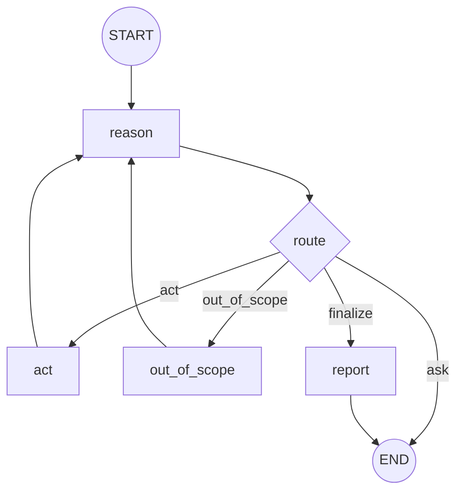

# design.md（ReAct型データ分析AIエージェント / LangGraph）

## 概要

本エージェントは **LangGraph** で構成するReAct型データ分析エージェントである。
ユーザーの自然言語要求を **reasonノード**で解釈し、act側には **構造化spec（JSON相当）**で指示する。
act側は spec に従って **実データ（メモリ上のDataFrame）**に対して EDA/集計/可視化/相関 等を実行し、結果（表/図/要約）を蓄積する。
最後に report ノードが Markdownレポート（最低限: 結論・根拠・再現要約）を生成して UI に表示する。

## 制約（requirementsからの転記）

- ネットワーク: **OpenAI（LLM API）通信のみ許可**
- ファイル: ローカルFS read/write禁止（アップロード後はメモリ上で処理、図もメモリ生成してUI表示のみ）
- リソース: 1分析アクション **30秒 / 1GB**
- 許可ライブラリ: `pandas`, `numpy`, `sklearn`, `matplotlib`, `seaborn`
- データ管理: Streamlit(UI)が `dataset_id` + プロセス内レジストリで DataFrame を保持

## グラフ構成

### 構成要素の対応（ノード/エッジ/ツール）

本設計における用語の対応は以下の通り。

- **ノード（Node）**: LangGraph の `graph.add_node(name, fn)` で登録する処理単位
- **エッジ（Edge）**: LangGraph の `graph.add_edge(...)` / `graph.add_conditional_edges(...)` による遷移
- **ツール（Tool）**: actノードから呼び出す「分析/可視化の実行ユニット」（関数・クラスのどちらでも可）。本設計ではツール呼び出しを2系統に集約する

#### ノード一覧

| node名 | 責務 | 主な入力（State） | 主な出力（State更新） |
|---|---|---|---|
| `reason` | ユーザー要求を解釈し、次アクションとspecを決める | `messages`, `dataset_id`, `dataset_summary`, `artifacts`, `last_error` | `next_action`, `rationale`, `clarifying_questions`, `assumptions`, `analysis_spec`, `plot_spec` |
| `act` | specを実行してObservation生成 | `dataset_id`, `analysis_spec`, `plot_spec` | `artifacts`, `logs`（実行要約）, `last_error` |
| `out_of_scope` | スコープ外要求への応答と代替案提示 | `messages`, `dataset_summary` | `messages`（不可+代替案）, `logs` |
| `report` | 最終Markdownレポート生成 | `messages`, `artifacts`, `assumptions`, `logs` | `final_report_md`, `messages`（レポート提示）, `logs` |

#### エッジ（遷移）一覧

| from | to | 種別 | 条件/理由 |
|---|---|---|---|
| `START` | `reason` | 直結 | 初回実行 |
| `reason` | `END` | 条件付き | `next_action == "ask"`（このターンは質問文を返して終了） |
| `reason` | `act` | 条件付き | `next_action == "act"` |
| `reason` | `out_of_scope` | 条件付き | `next_action == "out_of_scope"` |
| `reason` | `report` | 条件付き | `next_action == "finalize"` |
| `act` | `reason` | 直結 | Observation後に次手を再判断（ReActループ） |
| `out_of_scope` | `reason` | 直結 | 代替案/追加質問に応じて再判断 |
| `report` | `END` | 直結 | 完了 |

#### ツール一覧（actノード内部で使用）

| tool名 | 役割 | 入力 | 出力 |
|---|---|---|---|
| `execute_analysis(spec)` | `analysis_spec` を実行して表/要約を作る | `analysis_spec`（op/filters等）, `dataset_id`（df取得キー） | `Artifact[]`（table/text）, `run_log`（再現要約） |
| `execute_plot(spec)` | `plot_spec` を実行して図を作る | `plot_spec`（kind/filters等）, `dataset_id`（df取得キー） | `Artifact[]`（figure/text）, `run_log`（再現要約） |

### I/O契約（詳細）

この節は簡易サマリとし、各ノードの入力/出力/設計は **「## ノード設計」** に集約する。

### Mermaid



### 役割

- `reason`: ユーザー要求を解釈し、次アクションを決め、act用の `analysis_spec` / `plot_spec` を生成する（コード生成/実行はしない）。
- `ask`（`next_action="ask"`）: **このターンは `reason` が質問文（AIMessage）を生成して終了**する。次ターンのユーザー回答は新しい `graph.invoke()` で `messages` に入り、`reason` が再判断する。
- `act`: `analysis_spec` / `plot_spec` を実行し、Observation（表/図/要約）を生成してStateに蓄積する。
- `out_of_scope`: スコープ外要求（例: 予測モデル）に対して、できない旨＋代替案を提示してreasonに戻す。
- `report`: Markdownレポートを生成してStateに保存し終了する。

補足（運用前提）:
- Streamlit(UI)はユーザー入力のたびに **1回 `graph.invoke()`** する運用を前提とする（同一invoke内で「質問→ユーザー回答」を扱わない）。

### 終了条件（requirements準拠）

- `reason` が「ユーザー要求を満たした」と判断したら `finalize` を返す（`REQ-DONE-001`）。
- 深掘り案がある場合は report に任意提案として添付してよい（`REQ-DONE-002`）。

## State設計

### 方針

- Stateには **巨大なDataFrameを格納しない**（`dataset_id` 参照 + 概要 + 生成物カタログ）。
- `messages` は `add_messages` で蓄積する。
- 生成物（表/図）は `artifacts` として蓄積し、reportの根拠に使う。

### 記憶（チェックポイント）運用

本エージェントは **LangGraphのcheckpointer** により、`thread_id` 単位でState（`messages`含む）を永続化・復元する。
そのため、`next_action=="ask"` でこのターンが終了しても、次ターンの `graph.invoke()` で同一 `thread_id` を指定すれば対話文脈を保持できる。

- 実行時の前提:
  - `graph.compile(checkpointer=...)` を使用する
  - `config={"configurable": {"thread_id": "<stable-id>"}}` を毎回付与する

### TypedDict案

```python
from __future__ import annotations

from typing import Annotated, Literal, Sequence
import operator

from langchain_core.messages import BaseMessage
from langgraph.graph.message import add_messages
from typing_extensions import TypedDict


class Artifact(TypedDict):
    artifact_id: str
    kind: Literal["table", "figure", "text"]
    title: str
    description: str
    # table: JSON互換（records等） / figure: bytes（png等） / text: str
    payload: object


class AgentState(TypedDict):
    messages: Annotated[Sequence[BaseMessage], add_messages]
    logs: Annotated[list[str], operator.add]

    # UIが管理するデータ参照
    dataset_id: str | None
    dataset_summary: dict | None

    # reason->act 契約
    next_action: Literal["ask", "act", "out_of_scope", "finalize"] | None
    rationale: str | None
    clarifying_questions: list[str]
    assumptions: list[str]

    # 実行仕様（JSON相当）
    analysis_spec: dict | None
    plot_spec: dict | None

    # 観測結果
    artifacts: list[Artifact]
    last_error: str | None

    # 最終出力
    final_report_md: str | None
```

## 構造化spec（語彙）設計

### 目的

- reason が自然言語から **実行可能な仕様**へ落とす。
- act は spec を解釈して **テンプレート実装**で処理する（ブレを抑える）。

### analysis_spec.op（MVP語彙）

- `dataset_overview`
- `missingness`
- `column_summary`
- `duplicate_check`
- `groupby_agg`
- `share_ratio`（構成比/パレート）
- `correlation_matrix`

例（groupby集計）:

```json
{
  "type": "analysis",
  "op": "groupby_agg",
  "dataset_id": "ds_123",
  "group_cols": ["region"],
  "metrics": {"sales": ["sum", "mean"], "order_id": ["count"]},
  "filters": [],
  "sort": {"by": "sales_sum", "ascending": false},
  "top_k": 50
}
```

### plot_spec.kind（MVP語彙）

- `hist`
- `scatter`
- `line`
- `bar`
- `box`

例（箱ひげ）:

```json
{
  "type": "plot",
  "kind": "box",
  "dataset_id": "ds_123",
  "x": "region",
  "y": "sales",
  "title": "地域別の売上分布（箱ひげ）",
  "filters": []
}
```

### filters仕様（MVP）

- 条件結合: **ANDのみ**
- 演算子: `==`, `!=`, `>`, `>=`, `<`, `<=`, `in`, `contains`, `is_null`, `not_null`
- 日付/日時: 文字列から自動パースを試み、失敗時は追加質問またはエラー（黙って無視しない）

フィルタ要素の例:

```json
{"col":"date","op":">=","value":"2025-01-01"}
```

### 相関のデフォルト

- 対象列未指定の「相関見せて」:
  - 全数値列を候補とし、列数が多い場合は **上位N列（デフォルトN=10）** に絞って相関行列を出す（`REQ-CORR-001`）
  - ユーザーが列を指定した場合は、その列を必ず含め、残りを分散が大きい順で補完する

## ノード設計

### reason

#### 目的/責務

- ユーザー要求を解釈し、次アクションと実行仕様（`analysis_spec`/`plot_spec`）を決める。
- **コード生成/実行は行わない**（act側に委譲）。

#### 入力（読むState）

- `messages`: 最新ユーザー発話を含む会話履歴
- `dataset_id`: UIレジストリ参照キー
- `dataset_summary`: 列名/型/行数などの概要（列候補提示に使用）
- `artifacts`: 既存の表/図（重複実行回避、レポート根拠の参照）
- `last_error`: 直前の失敗（回復策の判断材料）

#### 出力（書くState）

- `next_action`: `"ask" | "act" | "out_of_scope" | "finalize"`
- `rationale`: 次アクションの理由（短文）
- `clarifying_questions`: 不足情報を埋める質問（最小限）
- `assumptions`: 仮定案（必要時。確認文言の材料）
- `analysis_spec` / `plot_spec`: 実行仕様（JSON相当）。不要なら `None`
- `messages`: `next_action=="ask"` の場合、質問文（AIMessage）を追加して終了してよい
- `logs`: 判断要約（任意）

#### 判断ルール（例）

- `dataset_id` が無い → `next_action="ask"`（アップロード促し）
- スコープ外（予測モデル等） → `next_action="out_of_scope"`
- 不足情報（列名/粒度/指標/filters等）がある → `next_action="ask"`
- ユーザー要求を満たせた → `next_action="finalize"`
- それ以外 → `next_action="act"`

### ask（ノード分離しない）

#### 目的/責務

- `next_action=="ask"` の場合に、ユーザーへ質問（または仮定案＋確認）を提示し、このターンを終了する。

#### 入力（読むState）

- `clarifying_questions`
- `assumptions`

#### 出力（書くState）

- `messages`: 質問文（AIMessage）を追加
- `logs`: 質問提示の要約

#### 備考

- ユーザー回答は次ターンの `messages` として入り、次の `reason` が解釈する（同一invoke内で回答を待たない）。

### act

#### 目的/責務

- `analysis_spec`/`plot_spec` を実行してObservation（表/図/要約）を生成し、Stateに蓄積する。

#### 入力（読むState）

- `dataset_id`: UIレジストリからDataFrameを取得するためのキー
- `analysis_spec` / `plot_spec`: 実行する仕様（どちらか、または両方）

#### 出力（書くState）

- `artifacts`: 生成した表/図/要約（Evidence）
- `logs`: 実行したspecの要約（再現要約に使用）
- `last_error`: 失敗時にセット（成功時は `None` に戻す運用でも良い）

#### 実装メモ（内部処理の粒度）

- `analysis_spec` がある場合: `execute_analysis(spec)` を呼び、返った `Artifact[]` と `run_log` をStateへ反映
- `plot_spec` がある場合: `execute_plot(spec)` を呼び、返った `Artifact[]` と `run_log` をStateへ反映

#### 成功時の最低条件

- `Artifact(kind="table" or "figure")` を1件以上追加するか、少なくとも `Artifact(kind="text")` を追加する。

### out_of_scope

#### 目的/責務

- スコープ外要求（例: 予測モデル）に対して、できない旨を明示し、MVP範囲で可能な代替案を提示する。

#### 入力（読むState）

- `messages`: ユーザー要求（スコープ外判断の根拠）
- `dataset_summary`: 代替案提示の材料（列候補など）

#### 出力（書くState）

- `messages`: 「MVP外」+「代替案（EDA/集計/可視化で可能な範囲）」の提示
- `logs`: 対応不能の理由（監査・再現用）

### report

#### 目的/責務

- `artifacts` と `assumptions` と実行ログから、Markdownレポートを生成する。

#### 入力（読むState）

- `artifacts`: 根拠（表/図/要約）
- `assumptions`: 仮定の明記
- `logs`: 実行要約（再現要約）

#### 出力（書くState）

- `final_report_md`: 最終Markdown
- `messages`: UI表示用のレポート本文（AIMessage）
- `logs`: レポート確定の事実

#### 出力形式（最低限）

- 必須: 結論 / 根拠（表/図参照） / 再現要約（実行したspecの要約）
- 任意: 追加深掘り提案（`REQ-DONE-002`）

## ツール設計（act側）

本設計ではツール数を増やしすぎないため、act側は以下の形で実装する。

- `execute_analysis(spec: dict) -> Artifact[]`
- `execute_plot(spec: dict) -> Artifact[]`

※ `dataset_id -> df` は **UIレジストリ**から取得する。LangGraphのツールはこのレジストリ取得関数に依存する。

## エラーハンドリング方針

- actでの例外は `last_error` に格納し、reasonへ戻す。
- reasonはエラー内容に応じて
  - 条件の緩和（サンプリング/列絞り）
  - 代替手段（別プロット/別集計）
  - 追加質問（列名確認、型変換確認）
  を選ぶ。

## セキュリティ/ガード

- 外部通信はOpenAIのみ（Web検索等は実装しない）。
- ローカルFS read/writeを行わない（図はメモリで生成しUI表示のみ）。
- specのバリデーション（未知の `op/kind/op` を拒否し、reasonへ差し戻す）。


